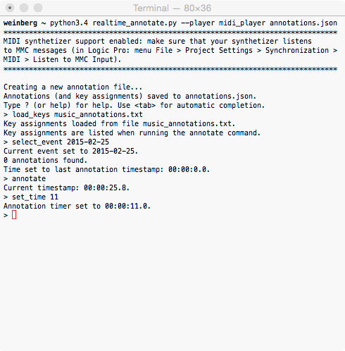

#####################
Real-time annotations
#####################

``realtime_annotate.py`` is a light-weight real-time annotation
program.

The **annotations** handled by this program are entered in real time with
a *single key* (with a meaning, e.g., "i" for "interesting
moment"), and an *optional digit* (that can be used for instance for
indicating a degree, e.g. "i9" could mean "extremely interesting").

Annotations have a **time stamp**. In a practical application, a piece
of music, etc. plays alongside the program. The annotation timer of
the program can be set to the time of the event being annotated
(command ``set_time``). For example, the play head of a music player
can thus be synchronized with the program's annotation timer.

The program optionally **automatically synchronizes the annotation
timer** with an external player (music player, etc.).  Thus, it can
automatically start and stop the player when starting and stopping the
annotation process, and can set the player's play head when the
annotation timer is set to a specific time.  An `implementation
<midi_player.py>`_ for automatically starting and stopping MIDI
instruments is provided (option ``--player midi_player``).

Annotations are stored for multiple events in a single **JSON file**
with a simple format.  This format has the advantage of being
perennial. The collected annotations can also be conveniently
manipulated by external programs (for manual editing, automatic
analysis, etc.).

The program runs in text mode, in a terminal:

The command shell of ``realtime_annotate.py`` offers the automatic
completion of commands and arguments, through the tabulation key.

Annotation process
==================

After selecting an **event** to annotate—possibly giving a new event
name—with the command ``select_event``, the ``annotate`` command
launches the real-time annotation process, during which keyboard keys
are converted into time-stamped annotations:

..image:: annotate.png

Typing a **key** adds one of the user-defined annotations (displayed
at the bottom of the terminal).

Any typed **digit** adds a **value** (or changes the value of) to the
last annotation (for example, the glitch at 00:00:12.6 in the
screenshot above has value 0).

It is also possible to **add annotations** to existing annotations:
the ``set_time`` command can be used to set the annotation timer time
(00:00:13.9, in the example above), and new annotations will simply be
added to the existing ones when running the ``annotate`` command.

Existing annotations can also be **deleted**: the last annotation is
deleted with the delete key.

Existing annotations are displayed in the "**Next annotation**" field,
so that the user can know what annotations have already been
entered. The next annotation is *highlighted during one second* before
it scrolls down to the list of previous annotations below (and is
replaced by the new next annotation, if any).

Installation and platforms
==========================

The program runs directly with Python 3.4+. Patches for support for
earlier Python versions are welcome.

It runs on Unix (including OS X). Windows support would require
replacing the curses module with an alternative: patches are welcome.

Usage
=====

The program is simply run with ``python3.4 realtime_annotate.py
<annotation_file>``, where ``python3.4`` should be replaced by the
name of the local Python 3.4+ interpreter, and where
``<annotation_file>`` is the path to the JSON file where annotations
will be saved and read.

Help
====

Help can be obtained with the ``-h`` or ``--help`` option of
``realtime_annotate.py``.

The program launches a command shell. Help with the commands of this
shell is available through ``?`` or ``help``.

Configuration of the annotations list
=====================================

The possible annotations and annotation keys are configured by the
user in a simple text file. For more information, see the built-in
help for the ``load_keys`` command. An simple `example
<music_annotations.txt>`_ for annotating music recordings is provided.

Automatic play
==============

The program can optionally automatically synchronize some player
(music player, etc.) with the annotation timer. This is done through
writing a Python module that contains a few player control function,
and specifying it through the ``--player`` option (e.g. ``--player
midi_player``). See ``realtime_annotate.py -h`` for details.

Annotation file format
======================

The annotation file structure in JSON should be mostly self-explanatory.

Annotation times are stored as an ``[hours, minutes, seconds]`` array.
``hours`` and ``minutes`` are integers, and ``seconds`` is a
float. ``minutes`` and ``seconds`` are in the [0; 60) interval.  There
is no limit on the number of hours.

Annotations are stored as an array. This array contains the annotation
key (e.g. "i" for "interesting moment"). If the annotation has an
attached numerical value (number in 0–9), then the array contains a
second element with this value.

The JSON file also contains an object with the annotation keys and
their meaning. This part of the file can be conveniently updated by
``realtime_annotate.py`` through its ``load_keys`` command.

Contact
=======

This program was written by `Eric O. LEBIGOT (EOL)
<mailto:eric.lebigot@normalesup.org>`_. Patches, donations, bug
reports and feature requests are welcome.

