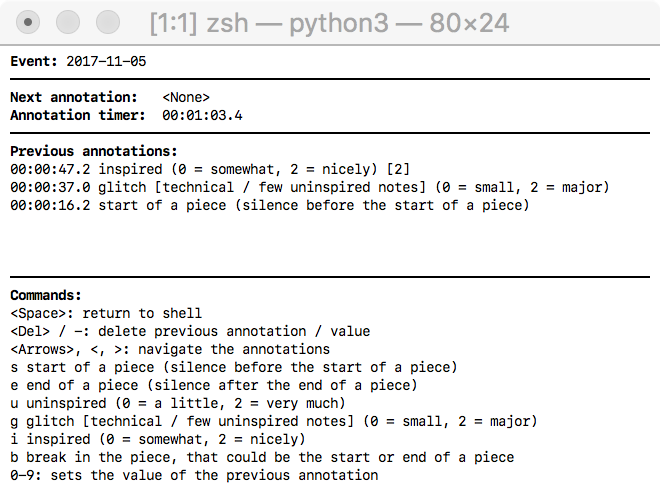

#####################
Real-time annotations
#####################

Overview
========

.. Benefits and description of the program for users, in one sentence:

``realtime_annotate.py`` is a light-weight program that lets users focus
on listening to a piece of music, watching a video, etc., and **make
pre-defined annotations very efficiently**. **Timestamps** are automatically
recorded. The program can also automatically **synchronize an external
player** (music or video player, etc.) while taking annotations (pause,
rewind, etc.).

.. How are the benefits obtained?

Users can focus on the annotation task thanks to the use of a **single
keyboard key** for adding an annotation. The program **automatically
handles time-related tasks** (time stamping, time navigation, and automatic
display of existing annotations around the current time stamp):

.. _screenshot:

.. Some details connected to the introductory paragraph:

More details
------------

The **annotations** handled by this program are entered in real time
with a *single key* (with a meaning, e.g., "i" for "interesting
moment"), and an *optional digit* (that can be used for instance for
indicating a degree, e.g. "i9" could mean "extremely
interesting"). Their meaning is pre-defined by the user before
starting the `annotation process`_.

Annotations have a **time stamp**, which is *automatically added* by
the program. In a practical application, a piece of music, etc. plays
alongside the program. The annotation timer of the program can be set
to the time of the event (show, film, etc.) being annotated (command
``set_time``). For example, the play head of a music player can thus
be synchronized with the user's annotation time stamps.

When going through an existing annotated event, existing **annotations
automatically scroll on screen**. An upcoming annotation is
*highlighted for one second* before is scrolls down to the list of
previous annotations: the user does not have to check the timer in
order to see whether he has already entered some annotation. The user
is thus freed from managing time and time stamps. There should be no
more inner monologues like this one:

- *Did I already indicate that the melody is good, here?*
- *Let me check the timer…*
- *00:01:23…*
- *Let's see if there is already an annotation around that time…*
- *Yeah, there is one at 00:01:24, I have already handled this.*

All of this is automatically handled by the program through the
scrolling display of annotations around the current timer, and the
user can better focus on the quality of his real-time annotations.

It is also possible to **manually jump** to the next or previous
annotations while annotating. The optional external player
automatically moves its play head. This makes revising, adding or
deleting annotations at a certain point in time convenient.

Annotations for *multiple events* are stored in a single **JSON file**
with a simple format.  This format has the advantage of being
perennial. The collected annotations can also be conveniently
*manipulated by external programs* (for manual editing, automatic
analysis, etc.).

.. The optional feature is left at the end, as it is less immediately
   important:

The program optionally **automatically synchronizes** the annotation
timer with an **external player** (music player, etc.).  Thus, it can
automatically start and stop the player when starting and stopping the
`annotation process`_, and can set the player's play head when moving through
annotations or when the annotation timer is set to a different time (either to
an absolute time or when navigating back or forward in time during the
annotation process).  *MIDI instruments* can be automatically controlled with
the `provided MIDI controller <midi_player.py>`_. Users can control *other
kinds of players* by writing a few Python functions.

.. Concrete implementation details and features:

The program runs in text mode, in a terminal:

The command shell of ``realtime_annotate.py`` provides the **automatic
completion** of commands and arguments, through the tabulation key.

Platforms and installation
==========================

The program runs directly with Python 3.4+. It currently runs on Unix
(including macOS).

Downloading `realtime_annotate.py <realtime_annotate.py>`_ is
sufficient for installing this program. It only uses standard modules
(of Python 3.4+)—they are generally installed along with Python.

Two example files are provided:

- a key assignment configuration: `music_annotations.txt
  <music_annotations.txt>`_,

- an optional external player that synchronizes MIDI players
  with the annotation timer: `midi_player.py <midi_player.py>`_.

Usage
=====

The program is simply run with ``python3 realtime_annotate.py
<annotation_file>`` (where ``python3`` should be replaced—if needed—by
the name of the local Python 3.4+ interpreter).  ``<annotation_file>``
is the path to the JSON file used for saving and reading annotations.

Users can then control the annotation process by using a command
shell. The main command is ``annotate``: it starts the real-time
`annotation process`_ proper.

Shell commands and help
=======================

.. The help section comes relatively early because it helps users to
   quickly test the program by themselves:

Help can be obtained with the ``-h`` or ``--help`` option of
``realtime_annotate.py``.

Help on the commands of the ``realtime_annotate.py`` command shell is
available through ``?`` or ``help`` (after launching the program).

With most Python installations, previous commands entered in the shell can be
accessed through the usual up and down arrows, and they can be
searched for with Ctrl-R (reverse history search) followed by the searched
text.

Workflow
========

Annotation keys definition
--------------------------

Some keyboard keys must be bound to a meaning, before annotating
events. This is done in a simple text file. For the format, see the
`example <music_annotations.txt>`_ and the help
(``realtime_annotate.py -h`` and the built-in ``help
load_keys``).

Typical workflow
----------------

A typical workflow starts by simply selecting an **event** to be
annotated (command ``select_event``). A *new event* can be created by
simply giving a new event name (of the user's choice). *Existing
events* are listed with ``list_events``.

Selecting an event to be annotated *automatically sets the annotation
timer* (to the annotation before the last time reached). If needed, a
different annotation **starting time** can be set with the
``set_time`` command. If a music player, etc. is controlled by the
program, its play head is set automatically to the same time.

The real-time annotation of the selected event can then be started
with the ``annotate`` command.

.. _annotation process:

Annotation process
""""""""""""""""""

The ``annotate`` command launches the real-time annotation process
(see the screenshot_ in the overview).

The **annotation timer** starts running when the user enters the
command, and the player (if any) automatically starts playing
(e.g. the piece of music to be annotated). The starting annotation
timer is typically set (beforehand) so that it coincides with the
event's time when the ``annotate`` command is entered (i.e. when the
Enter key is pressed): this way, the annotation timer is the same as
the event's timer (play head location of a music player, etc.), which
is convenient. If a music controller is used (see below_) this
time synchronization can be automatic.

Existing **annotations automatically scroll** on the
screen.

All **actions** are run with a *single* keyboard key (listed in the
help at the bottom of the ``annotate`` screen):

- Typing the **key** of one of the user-defined annotations adds it with
  the current annotation timer as a time stamp.

- Any typed **digit** adds a **value** to (or changes the value of)
  the *last* annotation (for example, the inspired part at 00:00:47.2
  in the first screenshot has value 2, meaning that this moment is
  "nicely inspired").

- Existing annotations can also be **deleted**: the last annotation
  (from the list of previous annotations) is deleted with the delete
  key, and any value associated with the last annotation can be
  deleted with the "-" key.

- **Navigating in time** is done with the arrow keys (left and right
  for navigating annotations, and up and down for moving the timer by
  ± 2 seconds), and with the "<" (first annotation) and ">" (last
  annotation) keys.

- **Stopping** the annotation process is done with the space key. If a
  player controller is used (``--player`` option), the player
  is stopped.

.. _below:

Synchronization with an external player
=======================================

The program can optionally automatically synchronize an external
player (music player, etc.) with the annotation timer. This is done
through writing a Python module that contains a few player control
function, and specifying it through the ``--player`` option
(e.g. ``--player midi_player``).  A working `MIDI instrument
controller <midi_player.py>`_ is provided; it can be used as an
example.  See ``realtime_annotate.py -h`` for details on how to write
a player controller module.

Annotation file format
======================

The annotation file `JSON <http://en.wikipedia.org/wiki/Json>`_
structure should be mostly self-explanatory.

Annotations are found in the ``"annotations"`` JSON entry, separately
for each event. Each event simply contains its list of annotations
(``"annotation_list"``), along with the position in the annotation list
where the user left off (``"cursor"``).

Each annotation is a pair containing a time stamp and the associated
annotation contents.

Annotation **time stamps** are stored as ``[hours, minutes,
seconds]``.  ``hours`` and ``minutes`` are integers, and ``seconds``
is a float. ``minutes`` and ``seconds`` are in the [0; 60) interval.
There is no limit on the number of hours. Negative hours are possible,
for annotations made before time 0; the formula for converting a time
stamp to a number remains valid: -1:59:0 means -1 hour + 59 minutes =
-1 minute.

Each **annotation contents** is stored as an array. This array first
contains the *annotation key* and its index in the history of key
assignments (e.g. ``["i", 2]``, which points to "interesting moment"
in the history, which is stored in the ``"key_assignments"`` JSON
entry).  If the annotation has an *attached numerical value* (number
in 0–9), then the array contains a second element with this value.

Notable updates
===============

Version 1.4 (2017-11-05)
------------------------

Keyboard keys can now freely be assigned to new annotations (through
the ``load_keys`` command).  Previous annotation meanings are thus not
overridden anymore when the annotation keys are bound to new meanings.

As a consequence, the format of the annotations file has changed
(annotation files from previous versions can still be read).

License
=======

This program and its documentation are released under the `Revised BSD
License <LICENSE.txt>`_.

Patches
=======

Patches for supporting earlier Python versions or for Windows are
welcome. Windows support would require replacing the curses module
with an alternative.

Contact
=======

This program was written by `Eric O. LEBIGOT (EOL)
<mailto:eric.lebigot@normalesup.org>`_. Patches, donations, bug
reports and feature requests are welcome.
